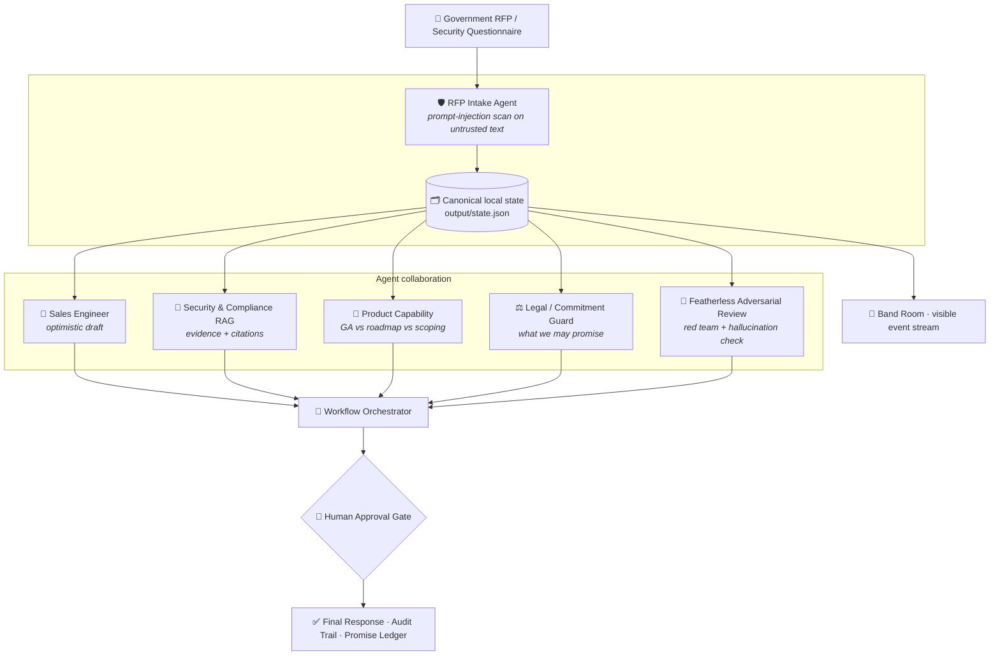
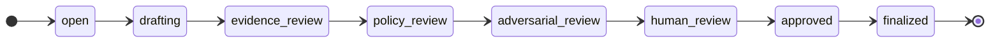
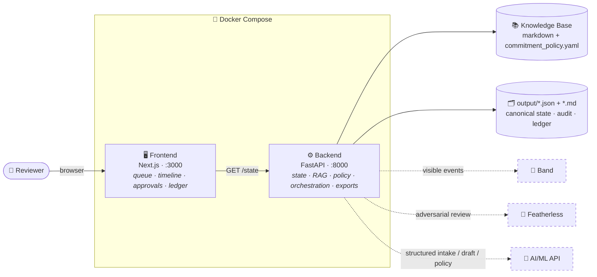

# BandGate

> **The multi-agent promise gate for cybersecurity and government RFPs.**

BandGate stops cybersecurity vendors from accidentally making unsupported, unsafe, or
contractually risky promises in government RFPs. Sales, Security, Legal, Product, Compliance,
and Delivery agents collaborate **before** an answer leaves the company. The system drafts
answers, checks every material claim against approved evidence or policy, blocks unsafe
language, red-teams the result for hallucination and prompt injection, escalates risky answers
to a human, and exports a **Promise Ledger** so delivery teams inherit every commitment.

> The RFP is only the container. The real product is **commitment control**.

- **Hackathon:** Band of Agents Hackathon
- **Track:** Track 1 — Internal Enterprise Workflows
- **Stack:** Python (FastAPI) backend · Next.js frontend · Docker Compose
- **Required visible integrations:** Band · Featherless · AI/ML API

See [PLAN.md](PLAN.md) for the full product spec and day-by-day build plan.

---

## Team

- **Ishita Bhattacharyya**
- **Soham Das**

---

## The problem

Enterprise RFPs and security questionnaires are not paperwork. **They are promises.** One
unsupported answer can silently become an SLA, a privacy obligation, a security disclosure, or
a delivery commitment the company cannot honor.

Cybersecurity and public-sector RFPs are the sharpest version of this problem:

- Vendors receive high-volume security questionnaires with rich, conflicting evidence (SOC 2,
  ISO 27001, FedRAMP, GDPR, HIPAA, PCI DSS, encryption, incident response, subprocessors, data
  residency).
- The conflicts are real and demo-friendly:
  - Sales wants to say **yes** to 99.99% uptime.
  - Legal blocks uncapped SLA or liability language.
  - Security refuses to share pentest reports without an NDA.
  - Compliance prevents FedRAMP overclaims.
- Government buyers demand auditability, approved wording, and evidence-backed answers.

Generic RFP tools are weakest exactly where it matters most: when answers must be
**policy-enforced and citation-gated**.

---

## What BandGate is (and is not)

BandGate is a Band-visible internal workflow for risky RFP commitments. It is a policy-aware
review system that drafts an answer, verifies it against approved evidence and policy, blocks or
rewrites unsafe language, escalates anything risky to a human, and records the whole trail. In
short, it is a human-approved promise gate for cybersecurity and government sales.

It is not a generic RFP response engine, and it does not replace Legal, Security, or Compliance.
It cannot answer any RFP on its own, and it never approves contractual language by itself — a
human always stays in the loop for risky commitments.

---

## How it works



The flow per question: **draft → retrieve evidence → policy review → adversarial review →
human review → approved → finalized.** A claim only survives into the final answer if it is
supported by approved evidence or by the commitment policy.



---

## The agents

Six logical agents plus one human gate. Some are implemented as deterministic backend functions
first (reliable for the demo), then upgraded to model calls where they add value.

| Agent | Role |
|---|---|
| **RFP Intake** | Parses CSV/PDF-like data into structured questions; classifies category; tags risk; assigns agents; **scans raw RFP text for prompt injection** (treats buyer content as untrusted). |
| **Sales Engineer** | Drafts buyer-friendly, optimistic answers. May include assumptions. Never finalizes commitments. |
| **Security & Compliance RAG** | Answers only from approved security/compliance evidence (SOC 2, ISO 27001, FedRAMP, encryption, incident response, access control, vuln management, retention, subprocessors). Every answer carries citations or is marked unsupported. |
| **Product Capability** | Distinguishes *generally available* vs *architecturally possible* vs *roadmap only* vs *requires custom scoping* vs *contractually approved*. |
| **Legal / Commitment Guard** | Enforces what the company may promise: SLA limits, liability caps, indemnity, DPA/residency language, NDA requirements, AI-training commitments, and human-approval routing. Deterministic rules backed by AI/ML API. |
| **Featherless Adversarial Reviewer** | Independent red team: prompt-injection detection, unsupported-claim detection, cross-answer contradiction detection, sensitive-disclosure detection, hallucination risk scoring. **The model that drafts the answer does not approve itself.** |
| **Human Approval Gate** | Required for high-risk commitments. Approve · approve with edits · escalate to Legal/Security · mark unsupported · reject. Human approval is a feature, not a weakness. |

---

## Policy and hallucination enforcement

### The hard rule

> **No final answer may contain a material claim unless it is supported by approved evidence
> or the commitment policy.**

If a claim is unsupported, BandGate blocks it, rewrites it to approved language, or escalates it
to a human.

### Claim support levels

| Level | Meaning |
|---|---|
| `supported_by_evidence` | Final answer may include the claim **with citation**. |
| `supported_by_policy` | Final answer may include approved policy wording. |
| `unsupported` | Block or escalate. |
| `contradicted_by_policy` | Block and rewrite. |
| `requires_human_approval` | Hold finalization until approved. |

### Deterministic conflict rules

Checked **before** relying on any LLM reasoning (see `backend/core/conflict.py`):

- SLA above the policy max without approval **blocks** finalization.
- `"FedRAMP authorized"` **blocks** unless policy says authorized.
- `"EU-only"` **blocks** when operational telemetry may be processed globally.
- Customer-data-training claims **block** when policy forbids them.
- Sensitive artifacts (SOC 2 report, pentest report, architecture diagram) **escalate** when an
  NDA is required.
- Buyer instructions to "ignore policy" are **prompt injection** and are ignored as untrusted
  input (see `backend/core/injection.py`).

### Commitment policy

The single source of truth for what the company may promise lives in
[`knowledge_base/policies/commitment_policy.yaml`](knowledge_base/policies/commitment_policy.yaml)
— SLA limits, privacy/residency stance, security-artifact NDA requirements, compliance status,
liability caps, and implementation timelines.

---

## Architecture



Solid arrows are the canonical local path that always works; dashed arrows are the external
provider integrations, each with a mocked fallback so a flaky API never breaks the demo.

---

## Tech stack

- **Backend:** Python 3.12, FastAPI, Uvicorn, Pydantic v2, PyYAML, pytest.
- **Frontend:** Next.js 16 (App Router, React 19, standalone output), TypeScript.
- **Infra:** Docker + Docker Compose.
- **Providers:** Band (visible agent collaboration), Featherless (adversarial review), AI/ML API
  (structured intake/draft/policy).

---

## Provider integrations

All three required integrations are designed to be **visible** in the demo while keeping local
state canonical, so a flaky API never breaks the run. Configure keys in `.env`:

| Variable | Used by | Purpose |
|---|---|---|
| `FEATHERLESS_API_KEY` | Adversarial reviewer | Independent red-team / hallucination scoring. |
| `AIML_API_KEY` | Intake + drafting + policy | Structured extraction and structured policy decisions. |
| `BAND_MODE` | Band client | `mock`, `lite`, or `live`; use `lite` while SDK/API quota is constrained. |
| `FEATHERLESS_MODE` | Adversarial reviewer | `mock`, `lite`, or `live`; use `lite` for the free trial tier. |
| `AIML_MODE` | Intake + drafting + policy | `mock`, `lite`, or `live`; use `lite` for the free tier. |
| `THENVOI_REST_URL` | Band SDK | REST base URL, default `https://app.band.ai/`. |
| `THENVOI_WS_URL` | Band SDK | WebSocket URL, default `wss://app.band.ai/api/v1/socket/websocket`. |
| `BAND_DEFAULT_ROOM_ID` | Band SDK | Optional existing room ID for demo routing. |
| `DEMO_MODE` | All providers | `mock` runs fully offline with deterministic fallbacks; set to live mode to exercise real provider calls. |

> Each provider has a mocked fallback path, but the demo keeps at least one visibly successful
> live call.

For the current free/lite provider situation, keep `DEMO_MODE=mock` for rehearsals and set only
the provider you are actively demonstrating to `lite`. Lite mode must use the smallest useful
payloads, cache/reuse outputs where possible, and fall back to deterministic local guardrails if
quota or rate limits fail.

### Band SDK setup

Band uses the `band-sdk` package and the `thenvoi` Python module. The SDK connects Remote
Agents to Band over REST + WebSocket. Each running agent needs credentials from the Band
platform:

1. In Band, create one **Remote Agent** for each BandGate role you want visible: Intake, Sales,
   Security, Product, Legal Guard, and Adversarial Reviewer.
2. Copy each Remote Agent's **Agent UUID** and one-time **API key** into `agent_config.yaml`.
   Start from `agent_config.yaml.example`; do not commit the real file.
3. Rooms are for collaboration and routing. A room does not issue every agent's credentials;
   each Remote Agent has its own UUID/API key and joins or is added to rooms through the SDK's
   room/participant tools.
4. The SDK exposes tools such as `thenvoi_send_message`, `thenvoi_send_event`,
   `thenvoi_add_participant`, `thenvoi_get_participants`, and `thenvoi_create_chatroom`.

The backend `BandClient` adapter records the same event payloads in `mock`/`lite` mode. Live
mode should run the six Remote Agents with `band-sdk` once `agent_config.yaml` is filled.

---

## Getting started

**Prerequisites:** Docker and Docker Compose.

```bash
# 1. Configure environment (provider keys optional in mock mode)
cp .env.example .env

# 2. Build and start backend + frontend
docker compose up --build
```

Then open:

- **Frontend dashboard:** http://localhost:3000
- **Backend health:** http://localhost:8000/health
- **Backend state (JSON):** http://localhost:8000/state

Run the demo pipeline and tests inside the backend container:

```bash
# Process the questionnaire and write output/state.json
docker compose run backend python run_demo.py

# Run backend tests
docker compose run backend pytest
```

---

## Local development without Docker

Useful for fast iteration. Relative paths (`data/`, `knowledge_base/`, `output/`) resolve from
the **repository root**, so always run backend commands from the repo root.

### Backend

```bash
# From repo root
python3 -m venv backend/.venv
backend/.venv/bin/pip install -e "backend[dev]"

# Run the demo pipeline
PYTHONPATH=backend backend/.venv/bin/python backend/run_demo.py

# Run the API (cwd must be repo root so data/ and knowledge_base/ resolve)
backend/.venv/bin/uvicorn app:app --app-dir backend --reload

# Run tests (from backend/ so pytest picks up pyproject config)
cd backend && .venv/bin/python -m pytest -q
```

### Frontend

```bash
cd frontend
npm install

# The UI falls back to lib/mockState.ts when no backend is reachable, so it
# renders standalone. Point it at the backend with BACKEND_URL when available.
BACKEND_URL=http://localhost:8000 npm run dev

# Type-check / production build
npx tsc --noEmit
npm run build
```

---

## API reference

| Method | Path | Description |
|---|---|---|
| `GET` | `/health` | Liveness probe — `{"status": "ok", "service": "bandgate-backend"}`. |
| `GET` | `/state` | Full `BandGateState` as JSON (built from the sample questionnaire). |
| `GET` | `/providers` | Current provider modes and whether each key/package is configured. |

The frontend's `page.tsx` reads `${BACKEND_URL}/state` and gracefully falls back to
`lib/mockState.ts` if the backend is unreachable.

---

## Testing

```bash
# Docker
docker compose run backend pytest

# Local
cd backend && .venv/bin/python -m pytest -q
```

Current coverage:

- **Conflict rules** (`test_conflict.py`) — SLA overcommitment, FedRAMP overclaim, EU-only
  residency, and prompt injection are correctly flagged.
- **Injection scan** (`test_injection.py`) — genuine prompt injection is detected; benign
  questions are not falsely flagged.
- **Retrieval** (`test_rag.py`) — the corpus chunks load, queries return ranked cited evidence,
  and empty queries return nothing.
- **Answer agents** (`test_agents.py`) — Sales overclaims on the SLA conflict and never echoes
  injection text; the Security agent is **citation-gated** (supported answers carry evidence,
  unmatched questions are marked unsupported); Product classifies capability levels; the
  pipeline attaches opinions to every question.
- **AI/ML client** (`test_model_clients.py`) — mock mode is the default and never calls the
  network; agents fall back to deterministic output when no provider is configured, and use the
  model when available.
- **Citation gate** (`test_citation_gate.py`) — a `supported_by_evidence` opinion with no
  citations is downgraded to `unsupported`; the pipeline emits no ungrounded supported claims.
- **Hardening** (`test_hardening.py`) — missing corpus yields empty retrieval (not a crash);
  malformed CSV rows are skipped and a missing file errors clearly; AI/ML retries transient
  failures and gives up cleanly, without retrying malformed responses.

---

## Knowledge base

A fictional but internally consistent corpus for **SentinelAI Security Platform**. Each document
includes approved wording, forbidden wording, conditions/exceptions, and an owning department.

RAG is intentionally simple and reliable:

```text
load markdown → chunk by heading → embed → retrieve top_k=4 → generate structured answer → attach citations
```

```text
company/   company_profile.md · approved_answer_library.md
security/  soc2_summary.md · iso27001_controls.md · encryption_policy.md
           incident_response_policy.md · vulnerability_management.md
           access_control_policy.md · fedramp_status.md
privacy/   dpa_summary.md · data_residency.md · subprocessors.md
           data_retention.md · ai_data_usage.md
product/   product_capabilities.md · ha_architecture.md · integrations.md
           implementation_timeline.md
legal/     msa_summary.md · sla_policy.md · liability_policy.md · nda_artifact_policy.md
policies/  commitment_policy.yaml
```

---

*Built for the Band of Agents Hackathon — Track 1: Internal Enterprise Workflows.*
